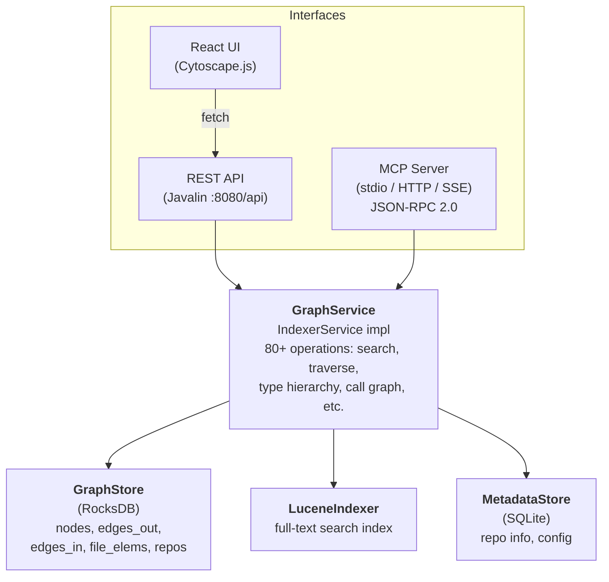
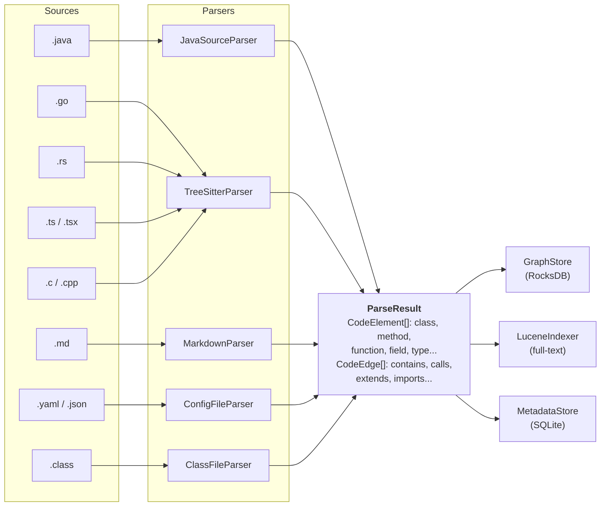
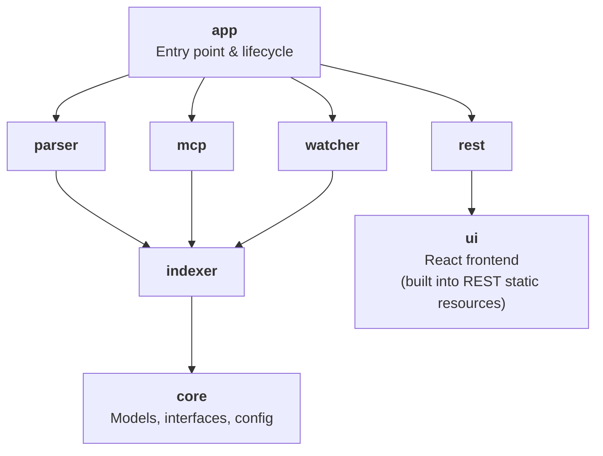
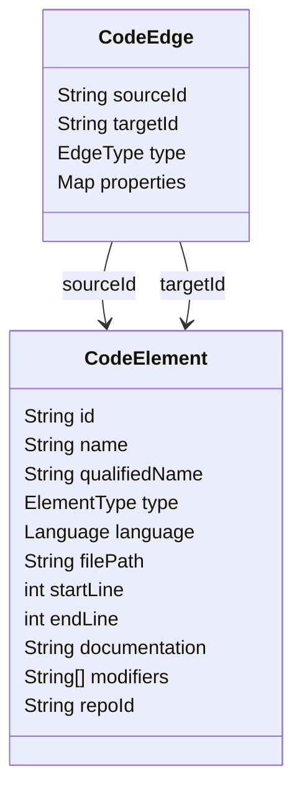

# Code Graph Search

A multi-language code analysis platform that builds a searchable graph representation of source code. It parses repositories across 8+ languages, extracts structural relationships (calls, inheritance, containment, dependencies), and exposes the graph via a REST API, interactive web UI, and MCP server for AI assistant integration.

## Features

- **Multi-language parsing**: Java, Go, Rust, TypeScript/JavaScript, C, C++, Markdown, YAML/JSON
- **Graph storage**: RocksDB-backed persistent graph with directional edge indices
- **Full-text search**: Lucene-powered search across all code elements
- **Graph traversal**: Shortest path, type hierarchies, call graphs, connectivity analysis
- **Real-time watching**: File system monitoring with debounced re-indexing
- **Three interfaces**: REST API, React web UI, and MCP (Model Context Protocol) server
- **Cross-repo links**: Model dependencies between repositories (e.g. gRPC calls)

## Architecture

### High-Level Overview



### Indexing Pipeline



### Module Dependency Graph



### Graph Data Model



#### Edge Types

| Category       | Types                                          |
|----------------|------------------------------------------------|
| Structural     | `CONTAINS`, `DEFINED_IN`, `PRECEDES`           |
| Type system    | `EXTENDS`, `IMPLEMENTS`, `OVERRIDES`, `MIXES_IN`, `USES_TYPE` |
| Call graph     | `CALLS`, `INSTANTIATES`                        |
| Dependencies   | `IMPORTS`, `DEPENDS_ON`                        |
| Documentation  | `DOCUMENTS`, `ANNOTATES`                       |
| Cross-language | `IMPLEMENTS_PROTO`, `CALLS_RPC`, `SHARES_TYPE` |
| Markdown       | `SECTION_OF`, `DOCUMENTS_DIR`                  |
| Config         | `CONFIGURES`, `REFERENCES_CLASS`               |

### MCP Tool Categories

```mermaid
graph LR
    subgraph "MCP / REST Tools"
        direction TB
        S["Search<br/><i>full-text search, name lookup</i>"]
        E["Element<br/><i>details, snippets, file outlines</i>"]
        ST["Structure<br/><i>parent, children, siblings</i>"]
        TH["TypeHierarchy<br/><i>supertypes, subclasses, overrides</i>"]
        CG["CallGraph<br/><i>callers, callees, call chains</i>"]
        IM["Import<br/><i>import/dependency analysis</i>"]
        DOC["Documentation<br/><i>comments, annotations</i>"]
        CON["Connectivity<br/><i>shortest path, FOAF similarity</i>"]
        R["Repo<br/><i>repository listing, management</i>"]
        IDX["IndexMgmt<br/><i>trigger indexing, progress</i>"]
    end
```



## Prerequisites

- **Java 21** (with preview features)
- **Maven 3.x**
- **Node.js & npm** (for building the React frontend)
- **tree-sitter CLI** (optional, for Go/Rust/C/C++/TypeScript parsing)

## Building

```bash
# Build the fat JAR (includes frontend)
./build.sh

# Or manually:
mvn package -DskipTests
```

The output is a single fat JAR at `app/target/code-graph-search.jar`.

## Configuration

Copy and edit the example config:

```bash
cp config-example.yaml config.yaml
```

```yaml
repos:
  - id: my-service
    name: My Service
    path: /path/to/your/repo
    languages: [java, go, rust, typescript]
    excludePatterns:
      - "**/target/**"
      - "**/build/**"
      - "**/.git/**"
      - "**/node_modules/**"
    classFiles:
      enabled: false
    crossRepoLinks:
      - repoId: another-service
        linkType: grpc
        description: "Calls another-service via gRPC"

indexer:
  dataDir: ./data
  watchDebounceMs: 500
  autoWatch: true
  indexingThreads: 4

server:
  port: 8080
  mcpHttpEnabled: true

treeSitter:
  enabled: true
  timeoutSeconds: 30
```

## Usage

### REST API + Web UI

```bash
./run.sh                      # uses config.yaml
./run.sh --config my.yaml     # custom config
```

Open `http://localhost:8080` in a browser for the interactive graph explorer UI.

### MCP Server (for Claude Desktop / Claude Code)

```bash
./run-mcp.sh                      # uses config.yaml
./run-mcp.sh --config my.yaml     # custom config
```

This starts the server in MCP stdio mode for use with AI assistants. Point your Claude Desktop or Claude Code MCP configuration to this script.

### Startup Flow

1. Load configuration from YAML
2. Initialize storage backends (RocksDB, Lucene, SQLite)
3. Parse and index all configured repositories in parallel
4. Start the selected interface (REST+UI or MCP stdio)
5. Optionally start file watcher for live re-indexing

## Supported Languages

| Language   | Parser             | Extensions                            |
|------------|--------------------|---------------------------------------|
| Java       | JavaParser         | `.java`                               |
| Go         | tree-sitter        | `.go`                                 |
| Rust       | tree-sitter        | `.rs`                                 |
| TypeScript | tree-sitter        | `.ts`, `.tsx`                         |
| JavaScript | tree-sitter        | `.js`, `.jsx`, `.mjs`, `.cjs`         |
| C          | tree-sitter        | `.c`, `.h`                            |
| C++        | tree-sitter        | `.cpp`, `.cc`, `.cxx`, `.hpp`, `.hxx` |
| Markdown   | Flexmark           | `.md`, `.markdown`                    |
| YAML/JSON  | SnakeYAML/Jackson  | `.yaml`, `.yml`, `.json`              |
| Java class | ASM bytecode       | `.class` (in JARs)                    |

## Tech Stack

| Component       | Technology                                      |
|-----------------|-------------------------------------------------|
| Language        | Java 21 (preview features)                      |
| Build           | Maven multi-module                              |
| Graph store     | RocksDB 8.11                                    |
| Search index    | Apache Lucene 9.10                              |
| Metadata        | SQLite 3.45                                     |
| HTTP server     | Javalin 6.3 (Jetty)                             |
| Java parsing    | JavaParser 3.28                                 |
| Multi-lang parse| tree-sitter CLI                                 |
| Bytecode        | ASM 9.7                                         |
| Frontend        | React 18, TypeScript, Vite, Tailwind CSS        |
| Graph viz       | Cytoscape.js (dagre + cose-bilkent layouts)     |
| Code display    | CodeMirror 6                                    |
| Data fetching   | TanStack React Query                            |
| Serialization   | Jackson 2.17                                    |

## Project Structure

```
code-graph-search/
├── core/           Core data models (CodeElement, CodeEdge, GraphService interface)
├── parser/         Multi-language source code parsers
├── indexer/        Storage layer (RocksDB graph, Lucene search, SQLite metadata)
├── watcher/        File system monitoring with debounced re-indexing
├── mcp/            MCP server (JSON-RPC 2.0, stdio/HTTP/SSE transports)
├── rest/           REST API server + static file serving
├── ui/             React frontend (Cytoscape graph viz, CodeMirror)
├── app/            Application entry point and lifecycle management
├── tests/          Integration and unit tests
├── build.sh        Build script
├── run.sh          Run REST + UI mode
├── run-mcp.sh      Run MCP stdio mode
└── config-example.yaml
```

## License

All rights reserved.
