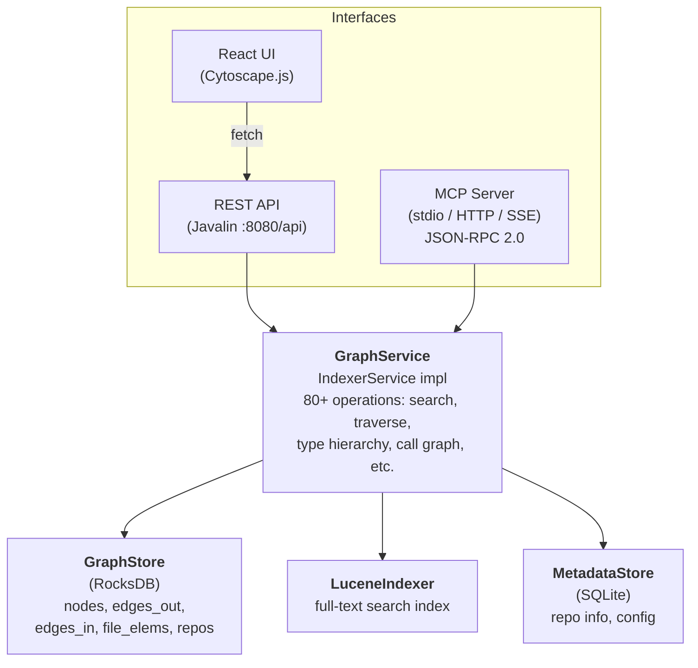
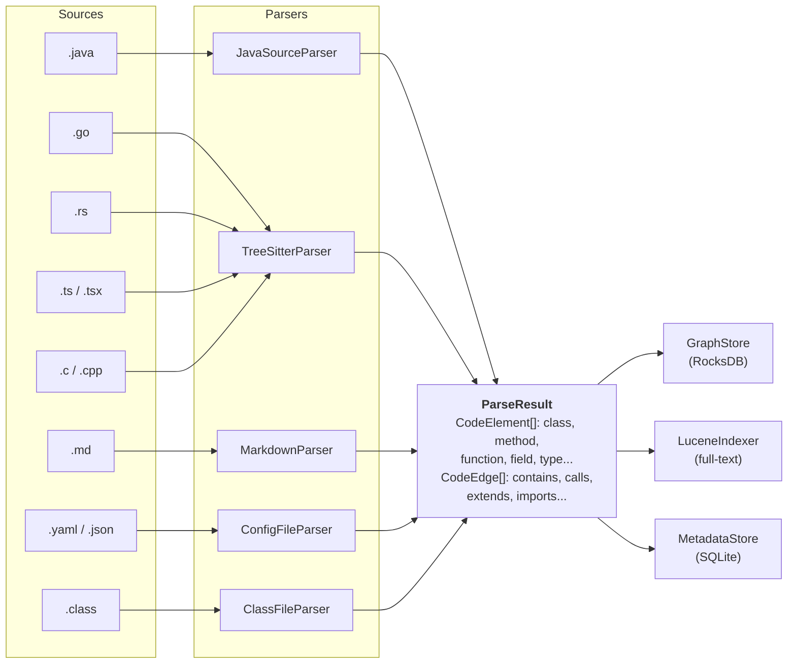
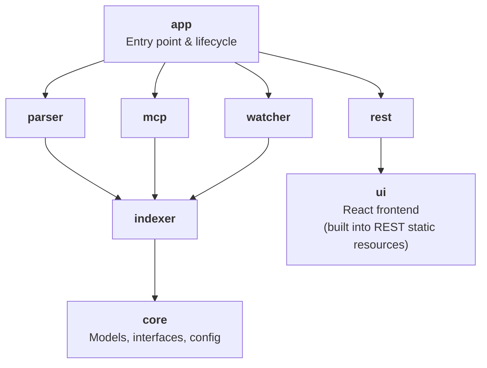
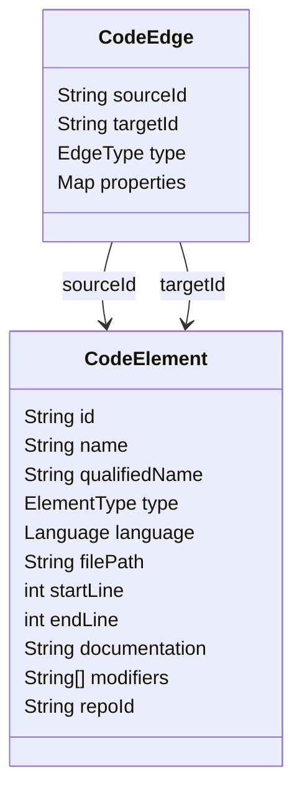
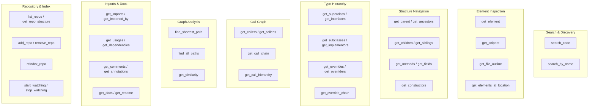
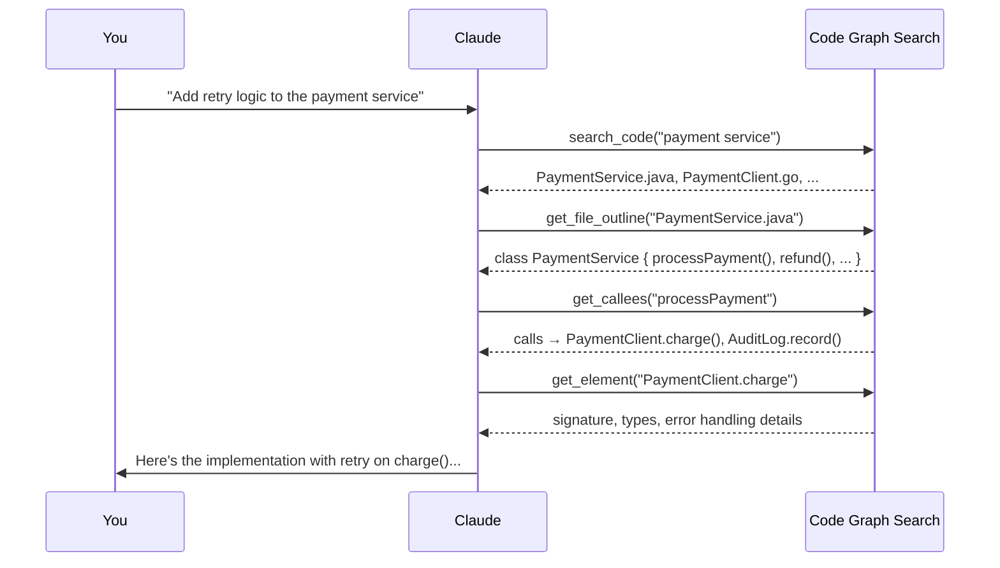
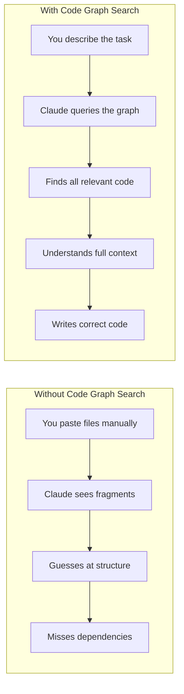

# Code Graph Search

A multi-language code analysis platform that builds a searchable graph representation of source code. It parses repositories across 8+ languages, extracts structural relationships (calls, inheritance, containment, dependencies), and exposes the graph via a REST API, interactive web UI, and MCP server for AI assistant integration.

## Features

- **Multi-language parsing**: Java, Go, Rust, TypeScript/JavaScript, C, C++, Markdown, YAML/JSON
- **Graph storage**: RocksDB-backed persistent graph with directional edge indices
- **Full-text search**: Lucene-powered search across all code elements
- **Graph traversal**: Shortest path, type hierarchies, call graphs, connectivity analysis
- **Real-time watching**: File system monitoring with debounced re-indexing
- **Three interfaces**: REST API, React web UI, and MCP (Model Context Protocol) server
- **Cross-repo links**: Model dependencies between repositories (e.g. gRPC calls)

## Architecture

### High-Level Overview



### Indexing Pipeline



### Module Dependency Graph



### Graph Data Model



#### Edge Types

| Category       | Types                                          |
|----------------|------------------------------------------------|
| Structural     | `CONTAINS`, `DEFINED_IN`, `PRECEDES`           |
| Type system    | `EXTENDS`, `IMPLEMENTS`, `OVERRIDES`, `MIXES_IN`, `USES_TYPE` |
| Call graph     | `CALLS`, `INSTANTIATES`                        |
| Dependencies   | `IMPORTS`, `DEPENDS_ON`                        |
| Documentation  | `DOCUMENTS`, `ANNOTATES`                       |
| Cross-language | `IMPLEMENTS_PROTO`, `CALLS_RPC`, `SHARES_TYPE` |
| Markdown       | `SECTION_OF`, `DOCUMENTS_DIR`                  |
| Config         | `CONFIGURES`, `REFERENCES_CLASS`               |

### MCP Tool Categories

```mermaid
graph LR
    subgraph "MCP / REST Tools"
        direction TB
        S["Search<br/><i>full-text search, name lookup</i>"]
        E["Element<br/><i>details, snippets, file outlines</i>"]
        ST["Structure<br/><i>parent, children, siblings</i>"]
        TH["TypeHierarchy<br/><i>supertypes, subclasses, overrides</i>"]
        CG["CallGraph<br/><i>callers, callees, call chains</i>"]
        IM["Import<br/><i>import/dependency analysis</i>"]
        DOC["Documentation<br/><i>comments, annotations</i>"]
        CON["Connectivity<br/><i>shortest path, FOAF similarity</i>"]
        R["Repo<br/><i>repository listing, management</i>"]
        IDX["IndexMgmt<br/><i>trigger indexing, progress</i>"]
    end
```



## Prerequisites

- **Java 21** (with preview features)
- **Maven 3.x**
- **Node.js & npm** (for building the React frontend)
- **tree-sitter CLI** (optional, for Go/Rust/C/C++/TypeScript parsing)

## Building

```bash
# Build the fat JAR (includes frontend)
./build.sh

# Or manually:
mvn package -DskipTests
```

The output is a single fat JAR at `app/target/code-graph-search.jar`.

## Configuration

Copy and edit the example config:

```bash
cp config-example.yaml config.yaml
```

```yaml
repos:
  - id: my-service
    name: My Service
    path: /path/to/your/repo
    languages: [java, go, rust, typescript]
    excludePatterns:
      - "**/target/**"
      - "**/build/**"
      - "**/.git/**"
      - "**/node_modules/**"
    classFiles:
      enabled: false
    crossRepoLinks:
      - repoId: another-service
        linkType: grpc
        description: "Calls another-service via gRPC"

indexer:
  dataDir: ./data
  watchDebounceMs: 500
  autoWatch: true
  indexingThreads: 4

server:
  port: 8080
  mcpHttpEnabled: true

treeSitter:
  enabled: true
  timeoutSeconds: 30
```

## Usage

### REST API + Web UI

```bash
./run.sh                      # uses config.yaml
./run.sh --config my.yaml     # custom config
```

Open `http://localhost:8080` in a browser for the interactive graph explorer UI.

### MCP Server (for Claude Desktop / Claude Code)

```bash
./run-mcp.sh                      # uses config.yaml
./run-mcp.sh --config my.yaml     # custom config
```

This starts the server in MCP stdio mode for use with AI assistants. Point your Claude Desktop or Claude Code MCP configuration to this script.

### Startup Flow

1. Load configuration from YAML
2. Initialize storage backends (RocksDB, Lucene, SQLite)
3. Parse and index all configured repositories in parallel
4. Start the selected interface (REST+UI or MCP stdio)
5. Optionally start file watcher for live re-indexing

## Using with Claude

Code Graph Search exposes 53 MCP tools that give Claude deep, structured understanding of your codebase — far beyond what fits in a context window. Instead of pasting files or hoping Claude guesses the right structure, it can query the graph for exactly what it needs: type hierarchies, call chains, cross-file dependencies, and more.

### Setup with Claude Code

Add the MCP server to your Claude Code configuration (`~/.claude/claude_code_config.json`):

```json
{
  "mcpServers": {
    "code-graph": {
      "command": "/absolute/path/to/code_graph_search/run-mcp.sh",
      "args": ["--config", "/absolute/path/to/config.yaml"]
    }
  }
}
```

### Setup with Claude Desktop

Add to your Claude Desktop config (`~/Library/Application Support/Claude/claude_desktop_config.json` on macOS):

```json
{
  "mcpServers": {
    "code-graph": {
      "command": "/absolute/path/to/code_graph_search/run-mcp.sh",
      "args": ["--config", "/absolute/path/to/config.yaml"]
    }
  }
}
```

Once configured, Claude can call any of the 53 tools directly during conversation. No special prompting is needed — Claude will discover the tools and use them when relevant.

### Available MCP Tools



### How Claude Uses the Tools

When Claude has access to Code Graph Search, a typical interaction looks like this:



Claude doesn't need to read every file — it navigates the graph to understand exactly the code paths that matter for the task.

## Vibe Coding with Code Graph Search

"Vibe coding" is the workflow where you describe what you want in natural language and let an AI assistant write the code. Code Graph Search dramatically improves this workflow by giving Claude structural awareness of your entire codebase.

### The Problem Without It

When vibe coding on a large project, Claude has limited context. It might:
- Duplicate existing utilities it can't see
- Use wrong method signatures from other modules
- Miss that a class has 12 subclasses that all need updating
- Break a call chain it doesn't know about
- Ignore project conventions visible in sibling code

### How Code Graph Search Helps



### Vibe Coding Workflows

#### 1. Feature Development

Tell Claude what you want, and it can discover where to put it:

> "Add a caching layer for the user lookup service"

Claude will use `search_code` to find the service, `get_callees` to see what it calls, `get_callers` to see who depends on it, and `get_file_outline` to understand the class structure — then write code that fits naturally into the existing architecture.

#### 2. Bug Investigation

Describe a symptom and let Claude trace the problem:

> "Users are seeing stale data after profile updates"

Claude can use `get_call_chain` to trace from the update endpoint through to the cache, `get_usages` to find everywhere the cache is read, and `get_subclasses` to check if any override is bypassing invalidation.

#### 3. Refactoring at Scale

Ask for a cross-cutting change and Claude can find everything that needs updating:

> "Rename the `userId` field to `accountId` across the codebase"

Claude uses `search_by_name` to find the field, `get_usages` to find every reference, `get_subclasses` to find all classes that inherit it, and `get_implementors` to check interface contracts — then makes changes across all affected files.

#### 4. Understanding Unfamiliar Code

Point Claude at a repo and ask questions:

> "How does the authentication flow work end to end?"

Claude uses `search_code("auth")` to find entry points, then follows `get_callees` and `get_call_hierarchy` to map out the full flow, `get_superclass` and `get_interfaces` to understand the abstraction layers, and `get_docs` to pull in documentation — then gives you a clear explanation with specific file/line references.

#### 5. Cross-Language Tracing

For polyglot projects, trace flows across language boundaries:

> "What happens when the frontend calls the createOrder API?"

Claude can use `find_cross_language` to follow from the TypeScript API client through to the Go handler and into the Java persistence layer, seeing the full picture across all three languages.

### Tips for Effective Vibe Coding

1. **Index all related repos** — Configure `crossRepoLinks` between services so Claude can trace dependencies across repository boundaries
2. **Enable file watching** — Set `autoWatch: true` so the graph stays current as you and Claude make changes
3. **Be specific about scope** — "Add validation to the order endpoint" is better than "improve the code" because Claude can search for exactly the right context
4. **Let Claude explore** — Don't paste code manually; let Claude use the tools to discover what it needs. It will often find relevant code you didn't think to share
5. **Use for review too** — After Claude writes code, ask it to check how the new code fits: "Does this new method match the patterns used by sibling methods in the same class?"

## Supported Languages

| Language   | Parser             | Extensions                            |
|------------|--------------------|---------------------------------------|
| Java       | JavaParser         | `.java`                               |
| Go         | tree-sitter        | `.go`                                 |
| Rust       | tree-sitter        | `.rs`                                 |
| TypeScript | tree-sitter        | `.ts`, `.tsx`                         |
| JavaScript | tree-sitter        | `.js`, `.jsx`, `.mjs`, `.cjs`         |
| C          | tree-sitter        | `.c`, `.h`                            |
| C++        | tree-sitter        | `.cpp`, `.cc`, `.cxx`, `.hpp`, `.hxx` |
| Markdown   | Flexmark           | `.md`, `.markdown`                    |
| YAML/JSON  | SnakeYAML/Jackson  | `.yaml`, `.yml`, `.json`              |
| Java class | ASM bytecode       | `.class` (in JARs)                    |

## Tech Stack

| Component       | Technology                                      |
|-----------------|-------------------------------------------------|
| Language        | Java 21 (preview features)                      |
| Build           | Maven multi-module                              |
| Graph store     | RocksDB 8.11                                    |
| Search index    | Apache Lucene 9.10                              |
| Metadata        | SQLite 3.45                                     |
| HTTP server     | Javalin 6.3 (Jetty)                             |
| Java parsing    | JavaParser 3.28                                 |
| Multi-lang parse| tree-sitter CLI                                 |
| Bytecode        | ASM 9.7                                         |
| Frontend        | React 18, TypeScript, Vite, Tailwind CSS        |
| Graph viz       | Cytoscape.js (dagre + cose-bilkent layouts)     |
| Code display    | CodeMirror 6                                    |
| Data fetching   | TanStack React Query                            |
| Serialization   | Jackson 2.17                                    |

## Project Structure

```
code-graph-search/
├── core/           Core data models (CodeElement, CodeEdge, GraphService interface)
├── parser/         Multi-language source code parsers
├── indexer/        Storage layer (RocksDB graph, Lucene search, SQLite metadata)
├── watcher/        File system monitoring with debounced re-indexing
├── mcp/            MCP server (JSON-RPC 2.0, stdio/HTTP/SSE transports)
├── rest/           REST API server + static file serving
├── ui/             React frontend (Cytoscape graph viz, CodeMirror)
├── app/            Application entry point and lifecycle management
├── tests/          Integration and unit tests
├── build.sh        Build script
├── run.sh          Run REST + UI mode
├── run-mcp.sh      Run MCP stdio mode
└── config-example.yaml
```

## License

All rights reserved.
